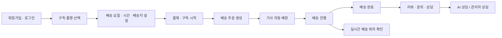
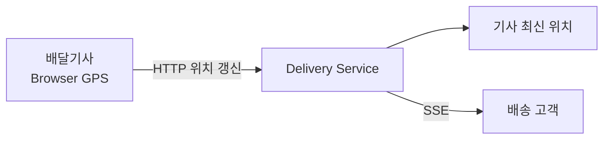
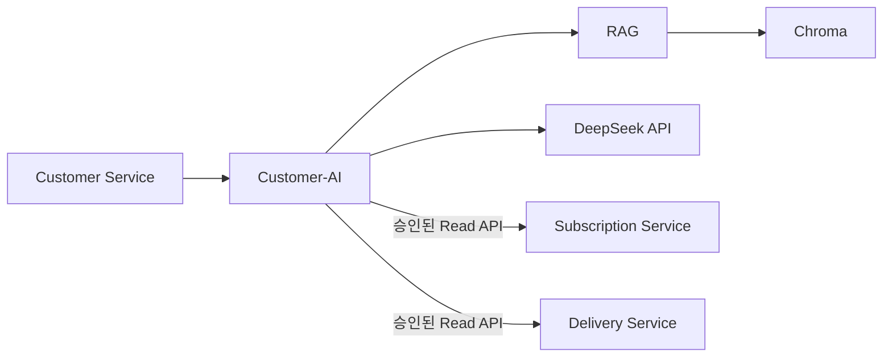
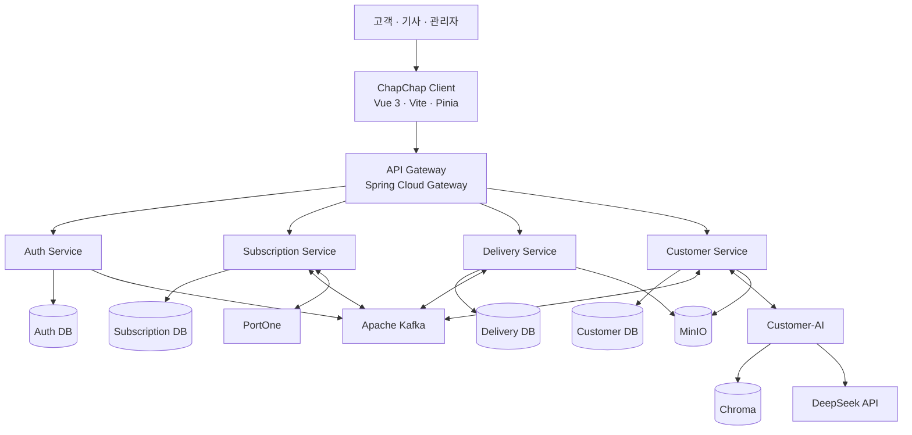
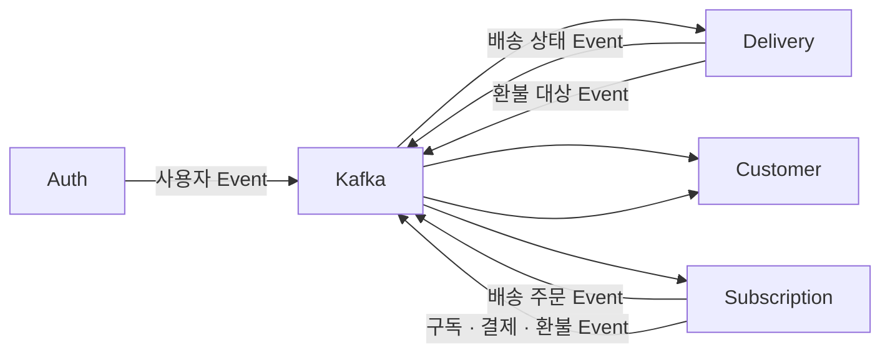
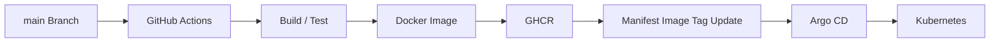

# 🍱 챱챱 ChapChap

> **바쁜 일상 속 식사 고민을 줄이기 위해, 원하는 식단과 배송 조건에 맞춰 도시락을 정기적으로 받아볼 수 있는 구독형 도시락 배송 서비스입니다.**

챱챱은 **구독 신청 → 결제 → 주문 생성 → 기사 배정 → 배송 → 고객 지원**까지 이어지는 과정을 하나의 서비스로 연결합니다.

고객은 원하는 플랜과 배송 요일·시간대·배송지를 설정해 도시락을 정기 구독할 수 있으며, 배송 진행 상황을 확인하고 상담과 문의까지 한 곳에서 이용할 수 있습니다.

---

## 🔗 바로가기

- [배포 서비스](https://chapchap.meerkat.p-e.kr)
- [Frontend](https://github.com/1-team-whyNot-chapchap/chapchap-client)
- [Auth Service](https://github.com/1-team-whyNot-chapchap/chapchap-auth-service)
- [Subscription Service](https://github.com/1-team-whyNot-chapchap/chapchap-subscription-service)
- [Delivery Service](https://github.com/1-team-whyNot-chapchap/chapchap-delivery-service)
- [Customer Service](https://github.com/1-team-whyNot-chapchap/chapchap-customer-service)
- [API Gateway](https://github.com/1-team-whyNot-chapchap/chapchap-gateway)

---

## 🧭 서비스 흐름



---

## 💡 프로젝트 소개

식사를 정기적으로 준비해야 하는 직장인이나 가구에게는 매번 메뉴를 고민하고 식사를 준비하는 과정 자체가 부담이 될 수 있습니다.

챱챱은 고객이 원하는 **구독 플랜과 배송 일정**을 설정하면 일정에 맞춰 도시락을 정기 배송하고, 구독 기간의 주문과 결제, 배송을 하나의 흐름으로 관리할 수 있도록 구성한 서비스입니다.

단순한 주문 기능에 그치지 않고 다음과 같은 전체 라이프사이클을 관리합니다.

```text
회원
 ↓
구독
 ↓
결제
 ↓
주문
 ↓
배송
 ↓
고객지원
```

각 영역은 하나의 서버에 모두 구현하지 않고 **MSA(Microservice Architecture)** 구조로 분리했습니다.

각 서비스는 자신이 담당하는 데이터와 업무 규칙을 소유하고, 서비스 간 업무 사실은 Kafka Event를 중심으로 전달합니다.

---

# ✨ 주요 기능

## 🔐 회원 · 인증

- 카카오·구글 OAuth2 소셜 로그인
- 사용자 회원가입 및 계정 관리
- Access Token / Refresh Token 기반 인증
- Access Token 재발급
- 고객·배달기사·관리자 역할 기반 접근 제어
- Gateway를 통한 공통 인증 처리
- 관리자 계정 및 권한 관리

---

## 🥗 구독 · 메뉴

고객은 자신의 생활 패턴에 맞게 도시락 구독 조건을 설정할 수 있습니다.

- 구독 플랜 및 메뉴 조회
- 배송 요일 선택
- 점심·저녁 배송 시간대 설정
- 배송지 설정
- 배송별 수량 설정
- 비대면 배송 조건 설정
- 28일 배송 일정 확인
- 현재 구독 상태 조회
- 구독 조건 변경
- 다음 이용 기간 준비
- 구독 해지

구독 서비스는 고객이 설정한 조건을 바탕으로 실제 배송에 필요한 주문을 생성합니다.

---

## 💳 결제 · 환불

- 결제수단 등록 및 관리
- 첫 구독 결제
- 정기 결제
- 결제 실패 재시도
- 결제 내역 조회
- 조건 변경에 따른 추가 결제·환불
- 배송 실패·지연에 따른 환불 연동
- 중복 결제 방지를 위한 멱등 처리

결제와 환불의 최종 업무 책임은 **Subscription Service**가 담당합니다.

---

## 🚚 배송

Subscription Service에서 확정된 주문은 Kafka Event를 통해 Delivery Service로 전달됩니다.

Delivery Service는 실제 배송 실행 과정을 담당합니다.

### 배송 대상 등록

- 다음 날 확정 주문 Kafka Event 수신
- 중복 Event·주문 등록 방지
- 같은 배송일·시간대 주문을 배송 그룹으로 구성

### 기사 자동 배정

기사 배정 시 다음 조건을 함께 확인합니다.

- 기사 계정 상태
- 배송 업무 활성 여부
- 담당 배송 지역
- 해당 날짜·시간대 근무 가능 여부
- 현재 배정된 방문지 수
- 현재 배정된 도시락 수량

기사별 수용량을 고려하여 자동으로 배송 목록을 생성합니다.

### 기사 업무

- 본인 배송 목록 조회
- 배정 목록 확인
- 수행 이슈 보고
- 배송 시작
- 배송 완료
- 배송 실패
- 비대면 배송 완료 사진 등록
- 근무 일정 조회
- 휴무 신청

### 관리자 배송 운영

- 자동 배정 결과 조회
- 수동 배정
- 기사 이슈 처리
- 재배정
- 배송 명단 최종 확정
- 배송 실패 처리
- 장애 발생 시 운영 복구
- 완료·실패 정보 정정
- Kafka Event 발행 실패 확인 및 재발행

---

## 📍 실시간 배송 위치

배송이 시작되면 담당 기사는 현재 위치를 Delivery Service로 전달합니다.



Delivery Service는 기사별 최신 위치만 관리하며, 해당 기사가 현재 배송 중인 고객에게 위치를 전달합니다.

현재 MVP에서는 GPS 전체 이동 경로나 위치 History를 저장하지 않습니다.

---

## 💬 고객지원 · 상담

Customer Service는 고객 상담과 운영 지원 기능을 담당합니다.

- 고객 상담 생성
- 상담 메시지 저장
- 실시간 상담 메시지 전달
- AI 상담
- 관리자 상담 전환
- 관리자 상담 배정
- 상담 종료
- 상담 요약
- FAQ 조회 및 관리
- 품질 문의
- 고객 알림
- 알림 읽음 처리
- 감사 이력 관리

Subscription Service와 Delivery Service에서 발생한 주요 업무 Event도 Kafka를 통해 Customer Service에 전달됩니다.

이를 통해 결제, 환불, 구독, 배송과 관련한 알림을 고객에게 제공할 수 있습니다.

---

## 🤖 AI 상담 · RAG

Customer-AI는 Customer Service 내부에서 사용하는 AI Runtime입니다.



주요 역할은 다음과 같습니다.

- 고객 문의 분류
- FAQ·정책 문서를 활용한 RAG 검색
- 근거 기반 상담 답변 생성
- 상담 내용 요약
- 현재 구독·결제·환불·배송 상태 확인
- 관리자 상담 전환 판단 지원

AI는 각 업무 서비스의 DB를 직접 조회하지 않습니다.

필요한 현재 상태는 각 Domain Service가 제공하는 **승인된 Read-only Internal API**를 통해 조회합니다.

최종 상담 상태와 메시지 저장 책임은 Customer Service가 유지합니다.

---

# 🏗️ 아키텍처

## 🧩 시스템 구성



---

## 🧱 서비스별 책임

| 서비스 | 역할 |
| --- | --- |
| **Client** | 고객·기사·관리자 Web UI 제공 |
| **API Gateway** | 외부 요청 단일 진입점, JWT 1차 검증, 서비스 라우팅 |
| **Auth Service** | 회원, 소셜 로그인, Token, 사용자 역할·인증 관리 |
| **Subscription Service** | 플랜, 구독, 배송 조건, 주문, 결제·환불 관리 |
| **Delivery Service** | 배송 대상 등록, 기사 배정, 배송 시작·완료·실패 관리 |
| **Customer Service** | 상담, FAQ, 문의, 알림, 관리자 고객지원 업무 |
| **Customer-AI** | RAG, AI 상담 응답, 현재 상태 조회 조립, 상담 요약 |

---

## 📨 서비스 간 통신

챱챱은 서비스 간 결합을 줄이기 위해 일반적인 업무 상태 전달에 **Apache Kafka**를 사용합니다.



예를 들어 Subscription Service가 다음 날 배송할 주문을 확정하면 Client가 Delivery Service를 다시 호출하는 것이 아니라 Kafka Event가 전달됩니다.

이를 통해 각 서비스는 자신의 데이터와 업무 책임을 유지하면서 필요한 사실만 공유합니다.

---

## 🔒 데이터 소유권

각 서비스는 **자신이 소유한 DB만 직접 조회·수정**합니다.

```text
Auth Service          → Auth DB
Subscription Service  → Subscription DB
Delivery Service      → Delivery DB
Customer Service      → Customer DB
```

다른 서비스의 DB Table을 직접 JOIN하거나 조회하지 않습니다.

서비스 간에는 필요한 식별자만 논리적으로 참조하며, 일반적인 상태 전달은 Kafka Event를 이용합니다.

---

# 📁 프로젝트 구조

<details>
<summary><strong>전체 저장소 구조 보기</strong></summary>

```text
ChapChap
│
├─ chapchap-client
│  └─ Vue 기반 고객·기사·관리자 Frontend
│
├─ chapchap-gateway
│  └─ API Gateway · JWT 검증 · 서비스 Routing
│
├─ chapchap-auth-service
│  └─ 회원 · 소셜 로그인 · 인증 · 권한
│
├─ chapchap-subscription-service
│  └─ 구독 · 주문 · 결제 · 환불
│
├─ chapchap-delivery-service
│  └─ 기사 배정 · 배송 실행 · 배송 상태
│
├─ chapchap-customer-service
│  └─ 상담 · 문의 · 알림 · FAQ · 지식 관리
│
└─ Customer-AI Runtime
   └─ RAG · LLM · 상담 응답 · 상담 요약
```

</details>

---

## 🖥 Frontend 구조

```text
src/
├─ domains/
│  ├─ admin/
│  ├─ auth/
│  ├─ customer/
│  ├─ delivery/
│  ├─ product/
│  ├─ rider/
│  └─ subscription/
│
├─ common/
├─ router/
├─ stores/
├─ App.vue
└─ main.js
```

화면과 기능은 도메인 단위로 분리합니다.

Frontend는 개별 Backend Service에 직접 요청하지 않고 API Gateway를 통해 통신합니다.

---

## ⚙️ Backend 구조

각 Spring Boot 업무 서비스는 도메인 중심으로 구성합니다.

```text
com.chapchap.{service}
├─ domain/
│  └─ {domain}/
│     ├─ controller/
│     ├─ service/
│     ├─ repository/
│     ├─ entity/
│     ├─ request/
│     └─ response/
│
└─ global/
   ├─ config/
   ├─ security/
   ├─ exception/
   ├─ kafka/
   └─ response/
```

주요 원칙은 다음과 같습니다.

- Controller는 HTTP 요청과 응답을 담당합니다.
- 실제 업무 규칙은 Service에서 처리합니다.
- Repository는 DB 접근을 담당합니다.
- Entity를 API Response로 직접 반환하지 않습니다.
- 서비스 간 DB 직접 접근을 허용하지 않습니다.
- 상태와 사유는 업무별 Enum으로 관리합니다.

---

# 🛠️ 기술 스택

| 영역 | 기술 |
| --- | --- |
| **Frontend** | Vue 3 · Vite · Vue Router · Pinia · Axios |
| **Frontend UI** | PrimeVue · lucide-vue-next · Chart.js |
| **Backend** | Java 21 · Spring Boot · Spring Web MVC |
| **Gateway** | Spring Cloud Gateway |
| **Security** | Spring Security · OAuth2 · JWT |
| **Persistence** | Spring Data JPA |
| **Database** | MySQL 8.x |
| **Messaging** | Apache Kafka · Spring Kafka |
| **Realtime** | WebSocket · Server-Sent Events |
| **AI Runtime** | Python · FastAPI · LangChain |
| **LLM** | DeepSeek API |
| **Vector Store** | Chroma |
| **Embedding** | intfloat/multilingual-e5-small |
| **Object Storage** | MinIO |
| **Payment** | PortOne API |
| **Container** | Docker · Docker Compose |
| **Orchestration** | Kubernetes |
| **CI/CD** | GitHub Actions · Argo CD |
| **API Docs** | SpringDoc OpenAPI · Swagger UI |
| **Test / Tool** | JUnit 5 · Postman · HeidiSQL |

각 라이브러리의 정확한 버전은 해당 서비스의 `build.gradle`, `package.json`, Python 의존성 파일과 Infrastructure 설정을 기준으로 합니다.

---

# 🚀 로컬 개발

## 사전 준비

- Java 21
- Node.js / npm
- Python
- MySQL 8.x
- Docker
- Docker Compose
- Apache Kafka
- MinIO

외부 서비스를 사용하는 기능을 테스트하는 경우 각 서비스의 테스트용 인증 정보도 필요합니다.

---

## 1️⃣ 저장소 Clone

```bash
git clone https://github.com/1-team-whyNot-chapchap/chapchap-client.git
git clone https://github.com/1-team-whyNot-chapchap/chapchap-gateway.git
git clone https://github.com/1-team-whyNot-chapchap/chapchap-auth-service.git
git clone https://github.com/1-team-whyNot-chapchap/chapchap-subscription-service.git
git clone https://github.com/1-team-whyNot-chapchap/chapchap-delivery-service.git
git clone https://github.com/1-team-whyNot-chapchap/chapchap-customer-service.git
```

---

## 2️⃣ Backend 실행

로컬 개발 기준 포트는 다음과 같습니다.

| Service | Port |
| --- | ---: |
| API Gateway | `8080` |
| Auth Service | `8081` |
| Subscription Service | `8082` |
| Delivery Service | `8083` |
| Customer Service | `8084` |

각 서비스 저장소에서 환경변수와 DB를 준비한 후 실행합니다.

```bash
./gradlew bootRun
```

Windows:

```powershell
.\gradlew.bat bootRun
```

환경변수 이름과 실행 Profile은 각 저장소의 실제 `.env.example`, `application.yml`, README를 기준으로 설정합니다.

---

## 3️⃣ Frontend 실행

```bash
cd chapchap-client

npm ci
npm run dev
```

기본 개발 서버:

```text
http://localhost:5173
```

Client의 `/api/**` 요청은 로컬 개발 환경에서 API Gateway로 전달됩니다.

```text
Client
  ↓
http://localhost:8080
  ↓
API Gateway
```

---

## 4️⃣ API 문서 확인

Gateway를 제외한 업무 서비스는 SpringDoc OpenAPI 기반 API 문서를 제공합니다.

공통 OpenAPI 경로:

```text
/api-docs
```

Gateway 통합 Swagger UI:

```text
/docs
```

실제 서비스별 Swagger 주소와 실행 설정은 각 저장소 README를 기준으로 확인합니다.

---

# 🐳 배포

각 서비스는 독립적인 Docker Image로 빌드합니다.



배포 흐름은 다음과 같습니다.

1. `main` 브랜치에 변경 사항을 반영합니다.
2. GitHub Actions가 애플리케이션을 빌드하고 테스트합니다.
3. Docker Image를 생성합니다.
4. Image를 GitHub Container Registry에 Push합니다.
5. 배포 Manifest의 Image Tag를 변경합니다.
6. Argo CD가 변경된 Manifest를 감지합니다.
7. Kubernetes 환경에 변경 사항을 반영합니다.

---

# ✅ 테스트 및 검증

서비스별로 다음 방식으로 기능을 검증합니다.

- JUnit 5 기반 단위 테스트
- Spring Boot 통합 테스트
- Spring Security 인증·인가 테스트
- Kafka Producer / Consumer 통합 테스트
- Postman API 테스트
- Swagger UI 요청·응답 확인
- MySQL 데이터 확인
- Kafka Event 및 DLT 확인
- MinIO 파일 저장 확인
- WebSocket / SSE 실시간 통신 확인
- Frontend 화면과 Backend API 통합 테스트

---

# 📌 주요 설계 원칙

### 1. 서비스별 데이터 소유권

각 서비스는 자신이 소유한 데이터베이스만 접근합니다.

### 2. Event 기반 서비스 연동

구독, 주문, 배송, 환불, 알림 등 서비스 간 상태 전달은 Kafka Event를 기본으로 합니다.

### 3. Gateway 단일 진입점

외부 Client는 Backend 업무 서비스에 직접 접근하지 않고 API Gateway를 통해 요청합니다.

### 4. 상태와 이력 보존

배송·결제처럼 중요한 업무 상태는 단순히 최종 결과만 저장하지 않고 변경 이력과 처리 사실을 함께 보존합니다.

### 5. 중복 처리 방지

결제 요청과 Kafka Event 등 재전달될 수 있는 작업은 멱등성을 고려해 중복 결과가 발생하지 않도록 처리합니다.

### 6. AI와 업무 Domain 분리

Customer-AI는 AI 처리에 집중하며 구독·배송·상담의 최종 업무 상태를 직접 소유하지 않습니다.

---

# 📚 서비스 저장소

| Repository | 설명 |
| --- | --- |
| [chapchap-client](https://github.com/1-team-whyNot-chapchap/chapchap-client) | Vue 기반 Frontend |
| [chapchap-gateway](https://github.com/1-team-whyNot-chapchap/chapchap-gateway) | API Gateway |
| [chapchap-auth-service](https://github.com/1-team-whyNot-chapchap/chapchap-auth-service) | 인증·회원 관리 |
| [chapchap-subscription-service](https://github.com/1-team-whyNot-chapchap/chapchap-subscription-service) | 구독·주문·결제·환불 |
| [chapchap-delivery-service](https://github.com/1-team-whyNot-chapchap/chapchap-delivery-service) | 기사 배정·배송 실행 |
| [chapchap-customer-service](https://github.com/1-team-whyNot-chapchap/chapchap-customer-service) | 상담·문의·알림·고객지원 |

---

## 🥢 ChapChap

**매일의 식사 고민은 줄이고, 구독부터 배송까지 하나의 흐름으로.**
