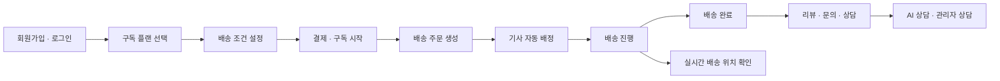
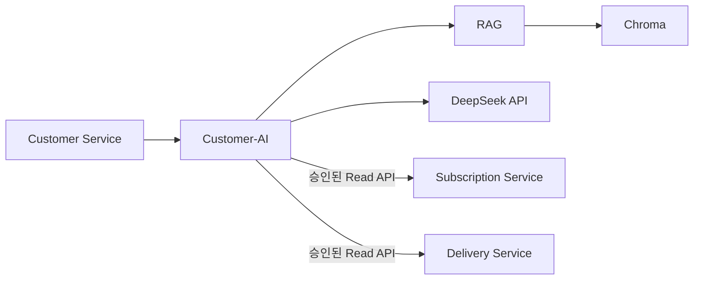
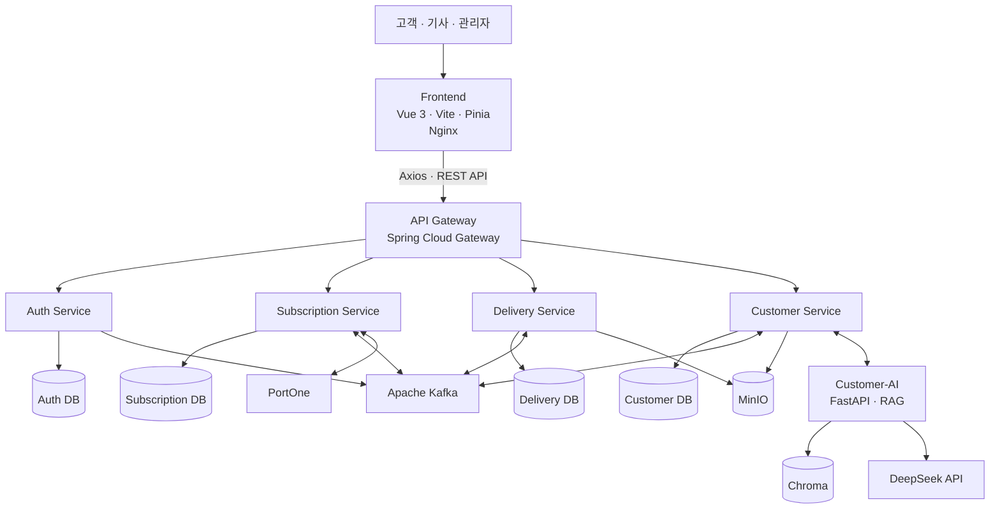
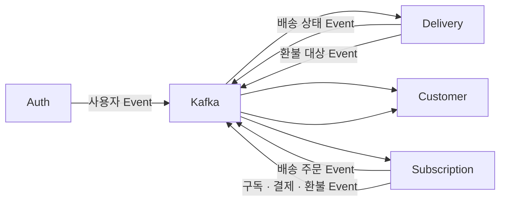
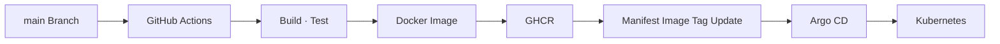

# 🍱 챱챱 ChapChap

> **식사 준비와 메뉴 선택이 부담스러운 고객이 원하는 플랜과 배송 일정에 맞춰 도시락을 정기 구독하고, 결제부터 배송·고객지원까지 한 곳에서 관리할 수 있는 도시락 정기배송 서비스입니다.**

챱챱은 **구독 신청 → 결제 → 주문 생성 → 기사 배정 → 배송 → 고객지원**까지 이어지는 과정을 하나의 서비스로 연결합니다.

---

## 🔗 바로가기

- [배포 서비스](https://chapchap.meerkat.p-e.kr/)
- [프런트엔드 저장소](https://github.com/1-team-whyNot-chapchap/chapchap-client)
- [Auth Service](https://github.com/1-team-whyNot-chapchap/chapchap-auth-service)
- [Subscription Service](https://github.com/1-team-whyNot-chapchap/chapchap-subscription-service)
- [Delivery Service](https://github.com/1-team-whyNot-chapchap/chapchap-delivery-service)
- [Customer Service](https://github.com/1-team-whyNot-chapchap/chapchap-customer-service)
- [API Gateway](https://github.com/1-team-whyNot-chapchap/chapchap-gateway)

---

## 🧭 서비스 흐름



---

## 💡 프로젝트 소개

직장인과 맞벌이 가구 등 바쁜 일상을 보내는 고객에게 매일 식사를 준비하고 메뉴를 선택하는 일은 반복적인 부담이 될 수 있습니다.

챱챱은 고객이 원하는 **구독 플랜과 배송 요일·수량·시간대·배송지**를 설정하면 28일 단위의 배송 일정을 구성하고, 정기결제부터 주문 생성, 기사 배정, 실제 배송과 고객지원까지 하나의 흐름으로 관리할 수 있도록 구성한 서비스입니다.

각 업무는 하나의 서버에 모두 구현하지 않고 **MSA(Microservice Architecture)** 구조로 분리했습니다. 각 서비스는 자신이 담당하는 데이터와 업무 규칙을 소유하며, 서비스 간 주요 상태 변화는 Kafka Event를 중심으로 연동합니다.

---

## 👥 팀 구성

| 팀원 | 담당 영역 |
| --- | --- |
| `서창훈` | Auth Service · API Gateway · Customer Service / AI · CD|
| `이예빈` | Subscription Service · 구독 · 배송지 |
| `편준현` | Subscription Service · 결제 · 주문 · 환불 |
| `조은혜` | Delivery Service |
| **공통** | Frontend · 서비스 연동 · 테스트 · CI|

---

## ✨ 서비스의 주요 기능

### 🔐 회원 및 인증 관리

- **소셜 로그인:** 카카오·구글 OAuth2 기반 회원 인증과 로그인
- **토큰 인증:** Access Token과 Refresh Token을 이용한 인증 및 Access Token 재발급
- **역할 관리:** 고객·배달기사·관리자 역할별 접근 권한 제어
- **Gateway 인증:** 외부 요청을 API Gateway에서 검증한 후 각 업무 서비스로 사용자 문맥 전달
- **관리자 관리:** 관리자 계정과 활성 상태 및 권한 관리

### 🥗 구독 및 배송 일정 관리

- **구독 플랜:** 이용 가능한 플랜과 메뉴를 조회하고 원하는 구독 상품 선택
- **배송 조건 설정:** 배송 요일, 수량, 점심·저녁 시간대, 배송지와 비대면 배송 조건 설정
- **배송 일정 생성:** 설정한 조건을 기준으로 28일 단위 배송 일정 구성
- **구독 관리:** 현재 구독과 다음 배송일 조회, 배송 조건 변경 및 구독 해지
- **자동 운영:** 다음 이용 기간 준비와 배송 주문 생성

### 💳 정기결제 및 환불

- **결제수단 관리:** 정기구독에 사용할 자동결제수단 등록 및 관리
- **첫 결제·정기결제:** 구독 시작 시 첫 결제 후 이용 기간 단위 자동결제
- **결제 실패 처리:** 정기결제 실패 건 재시도 및 상태 관리
- **환불 관리:** 구독 조건 변경이나 배송 결과에 따른 추가 결제·환불
- **결제 내역:** 고객별 결제와 환불 이력 조회
- **중복 방지:** 멱등성을 적용해 동일 결제의 중복 처리를 방지

### 🚚 기사 배정 및 배송 관리

- **배송 대상 등록:** Subscription Service에서 확정한 주문을 Kafka Event로 전달받아 배송 대상으로 등록
- **기사 자동 배정:** 담당 지역, 근무 가능 여부와 현재 수용 가능한 배송량을 기준으로 기사 자동 배정
- **배정 확인:** 기사가 본인의 배송 목록을 확인하고 수행이 어려운 항목에 대해 이슈 보고
- **배송 처리:** 고객별 배송 시작·완료·실패 상태와 비대면 배송 완료 사진 관리
- **배송 운영:** 관리자가 기사 이슈, 재배정, 최종 배송 명단과 배송 결과를 관리
- **휴무 관리:** 기사 휴무 신청과 관리자 승인 및 근무 일정 반영
- **운영 복구:** Kafka Event 처리 실패 및 배송 결과 정정 등 운영 기능 제공

### 📍 실시간 배송 위치

- **기사 위치 전송:** 배송 중 Browser Geolocation을 이용해 현재 위치를 Delivery Service로 전달
- **현재 위치 관리:** 기사별 최신 정상 위치를 저장하고 배송 종료 시 불필요한 위치 정보 제거
- **고객 위치 조회:** 배송 중인 고객에게 담당 기사 위치를 SSE 방식으로 전달
- **MVP 범위:** GPS 전체 이동 경로나 위치 History는 별도로 저장하지 않음

### 💬 고객 상담 및 지원

- **상담 관리:** 고객 상담 생성, 메시지 저장, 상담 상태 및 관리자 배정 관리
- **AI 상담:** FAQ와 정책 문서를 기반으로 한 RAG 방식의 상담 응답 제공
- **관리자 연결:** AI 상담으로 해결하기 어려운 문의를 관리자 상담으로 전환
- **상담 요약:** 관리자 연결 시 기존 대화 내용을 AI로 요약
- **FAQ·품질 문의:** FAQ 관리와 고객 품질 문의 및 첨부파일 관리
- **알림:** 구독·결제·환불·배송 Event를 기반으로 고객 알림 생성 및 실시간 전달

### 🤖 AI 상담 · RAG

Customer-AI는 Customer Service 내부에서 사용하는 AI Runtime입니다.



- 고객 문의 분류
- FAQ·정책 문서를 활용한 RAG 검색
- 근거 기반 상담 답변 생성
- 상담 내용 요약
- 현재 구독·결제·환불·배송 상태 확인
- 관리자 상담 전환 판단 지원

Customer-AI는 업무 서비스의 DB를 직접 조회하지 않습니다. 필요한 현재 상태는 각 Domain Service가 제공하는 **Read-only Internal API**를 통해 조회하며, 최종 상담 상태와 메시지는 Customer Service가 관리합니다.

---

## 🏗️ 아키텍처

### 🧩 시스템 구성



### 🧱 서비스별 책임

| 서비스 | 역할 |
| --- | --- |
| **Client** | 고객·기사·관리자 Web UI 제공 |
| **API Gateway** | 외부 요청 단일 진입점, JWT 1차 검증 및 서비스 라우팅 |
| **Auth Service** | 회원, 소셜 로그인, Token, 사용자 역할·인증 관리 |
| **Subscription Service** | 플랜, 구독, 배송 조건, 주문, 결제·환불 관리 |
| **Delivery Service** | 배송 대상 등록, 기사 배정, 배송 시작·완료·실패 관리, 실시간 배송 위치 |
| **Customer Service** | 상담, FAQ, 품질 문의, 알림 및 관리자 고객지원 |
| **Customer-AI** | RAG 검색, AI 상담 응답, 현재 상태 조회 조립 및 상담 요약 |

### 📨 서비스 간 통신

일반적인 업무 상태 전달은 **Apache Kafka**를 이용합니다.



예를 들어 Subscription Service가 다음 날 배송할 주문을 확정하면 Client가 Delivery Service를 다시 호출하는 것이 아니라 Kafka Event를 통해 배송 주문이 전달됩니다.

이를 통해 각 서비스는 자신의 데이터와 업무 책임을 유지하면서 필요한 업무 사실만 공유합니다.

### 🔒 데이터 소유권

각 서비스는 **자신이 소유한 DB만 직접 조회·수정**합니다.

```text
Auth Service          → Auth DB
Subscription Service  → Subscription DB
Delivery Service      → Delivery DB
Customer Service      → Customer DB
```

다른 서비스의 DB Table을 직접 JOIN하거나 조회하지 않으며, 필요한 식별자만 논리적으로 참조합니다.

---

## 📁 프로젝트 구조

<details>
<summary><strong>프로젝트 구조 보기</strong></summary>

```text
ChapChap
│
├─ chapchap-client/
│  ├─ src/
│  │  ├─ domains/
│  │  │  ├─ admin/              # 관리자 화면
│  │  │  ├─ auth/               # 로그인 · 회원가입 · 인증
│  │  │  ├─ customer/           # 상담 · 문의 · 알림
│  │  │  ├─ delivery/           # 고객 배송 · 위치 확인
│  │  │  ├─ product/            # 플랜 · 메뉴
│  │  │  ├─ rider/              # 기사 배송 · 일정
│  │  │  └─ subscription/       # 구독 · 결제
│  │  ├─ common/                # 공통 기능
│  │  ├─ router/                # 라우팅 · 인증 가드
│  │  └─ stores/                # 공통 상태 관리
│  ├─ Dockerfile
│  └─ nginx.conf
│
├─ chapchap-gateway/
│  └─ API Gateway · JWT 검증 · 서비스 Routing
│
├─ chapchap-auth-service/
│  └─ 회원 · OAuth2 · Token · 역할 관리
│
├─ chapchap-subscription-service/
│  └─ src/main/java/com/chapchap/subscription/
│     ├─ domain/
│     │  ├─ address/            # 배송지
│     │  ├─ currentstate/       # 상담용 현재 상태
│     │  ├─ order/              # 배송 주문
│     │  ├─ payment/            # 결제 · 환불 · 결제수단
│     │  ├─ subscription/       # 플랜 · 구독 · 배송 조건
│     │  └─ terms/              # 약관
│     └─ global/                # Kafka · 보안 · 예외 · 공통 설정
│
├─ chapchap-delivery-service/
│  └─ src/main/java/com/chapchap/delivery/
│     ├─ domain/
│     │  ├─ assignment/         # 기사 배정
│     │  ├─ delivery/           # 배송 실행 · 상태
│     │  └─ rider/              # 기사 · 근무 · 휴무
│     └─ global/                # Kafka · 보안 · 공통 설정
│
└─ chapchap-customer-service/
   └─ 상담 · FAQ · 품질 문의 · 알림 · 지식 관리
      └─ Customer-AI Runtime    # RAG · AI 응답 · 상담 요약
```

</details>

백엔드는 도메인 중심 구조를 사용하며 각 도메인은 `Controller → Service → Repository → Database` 계층을 중심으로 구성합니다.

인증, Kafka, 예외 처리, 공통 응답 등 여러 도메인에서 사용하는 기능은 각 서비스의 `global` 영역에서 관리합니다.

---

## 🛠️ 기술 스택

| 영역 | 기술 및 적용 기준 |
| --- | --- |
| **Frontend** | Vue 3 · Vite · Vue Router · Pinia · Axios · PrimeVue |
| **Frontend UI** | lucide-vue-next · Chart.js |
| **Backend** | Java 21 · Spring Boot · Spring Web MVC · Spring Security · Spring Data JPA |
| **Gateway** | Spring Cloud Gateway |
| **Database** | MySQL 8.x |
| **Messaging** | Apache Kafka · Spring Kafka |
| **Realtime** | WebSocket · Server-Sent Events |
| **AI** | Python · FastAPI · LangChain |
| **LLM** | DeepSeek API |
| **Vector Store** | Chroma |
| **Embedding** | intfloat/multilingual-e5-small |
| **Storage** | MinIO |
| **Payment** | PortOne API |
| **Build** | Vite · Gradle |
| **Infra / CI·CD** | Docker · Docker Compose · Kubernetes · GitHub Actions · Argo CD |
| **API / Test Tool** | SpringDoc OpenAPI · Swagger UI · JUnit 5 · Postman · HeidiSQL |

> 세부 버전은 각 저장소의 `package.json`, `build.gradle`, Python 의존성 파일과 Docker 설정 등 실제 구현 환경을 기준으로 확인합니다.

---

## 🚀 로컬에서 실행하기

> 사전 준비: Java 21, Node.js 및 npm, Python, MySQL 8.x, Docker, Docker Compose

### 1️⃣ 저장소 클론

```bash
git clone https://github.com/1-team-whyNot-chapchap/chapchap-client.git
git clone https://github.com/1-team-whyNot-chapchap/chapchap-gateway.git
git clone https://github.com/1-team-whyNot-chapchap/chapchap-auth-service.git
git clone https://github.com/1-team-whyNot-chapchap/chapchap-subscription-service.git
git clone https://github.com/1-team-whyNot-chapchap/chapchap-delivery-service.git
git clone https://github.com/1-team-whyNot-chapchap/chapchap-customer-service.git
```

### 2️⃣ 공통 인프라 준비

각 서비스가 사용하는 MySQL Database와 Kafka, MinIO 등 로컬 인프라를 준비합니다.

환경변수는 각 저장소의 `.env.example`, `application.yml` 또는 README를 기준으로 설정합니다.

```text
API Gateway          : 8080
Auth Service         : 8081
Subscription Service : 8082
Delivery Service     : 8083
Customer Service     : 8084
```

### 3️⃣ 백엔드 실행

각 Spring Boot 서비스 저장소에서 실행합니다.

macOS / Linux:

```bash
./gradlew bootRun
```

Windows:

```powershell
.\gradlew.bat bootRun
```

서비스별 Profile, DB, Kafka, MinIO 및 외부 API 환경변수는 각 저장소 설정을 기준으로 입력합니다.

### 4️⃣ 프런트엔드 실행

```bash
cd chapchap-client
npm ci
npm run dev
```

로컬 개발 환경에서 `/api/**` 요청은 Vite Proxy를 통해 API Gateway로 전달됩니다.

### 5️⃣ 접속

| 서비스 | 주소 |
| --- | --- |
| Web | `http://localhost:5173` |
| API Gateway | `http://localhost:8080` |
| Auth Service | `http://localhost:8081` |
| Subscription Service | `http://localhost:8082` |
| Delivery Service | `http://localhost:8083` |
| Customer Service | `http://localhost:8084` |

### 6️⃣ API 문서 확인

각 업무 서비스는 SpringDoc OpenAPI 기반 API 문서를 제공합니다.

```text
OpenAPI JSON : /api-docs
Swagger UI   : 각 서비스의 Swagger 설정 기준
```

실제 Swagger 주소와 실행 Profile은 각 서비스 저장소의 README와 설정 파일을 기준으로 확인합니다.

---

## 🐳 배포

각 서비스는 독립적인 Docker Image로 빌드합니다.



1. `main` 브랜치에 변경 사항을 반영합니다.
2. GitHub Actions에서 애플리케이션을 빌드하고 테스트합니다.
3. 서비스별 Docker Image를 생성합니다.
4. Image를 GitHub Container Registry에 Push합니다.
5. Kubernetes Manifest의 Image Tag를 갱신합니다.
6. Argo CD가 Manifest 변경을 감지합니다.
7. Kubernetes 환경에 변경 사항을 반영합니다.

---

## ✅ 테스트 및 검증

- JUnit 5 기반 단위·통합 테스트
- Spring Security 인증·인가 테스트
- Kafka Producer / Consumer 연동 테스트
- Postman API 테스트
- Swagger UI 요청·응답 확인
- MySQL 데이터와 상태 이력 확인
- Kafka Event 및 DLT 확인
- MinIO 파일 저장 확인
- WebSocket / SSE 실시간 통신 확인
- Frontend와 Backend API 통합 테스트
- 기사 위치 HTTP / SSE 흐름 확인

---

## 📌 주요 설계 원칙

### 1. 서비스별 데이터 소유권

각 서비스는 자신이 소유한 데이터베이스만 접근하며 다른 서비스의 DB를 직접 조회하거나 수정하지 않습니다.

### 2. Event 기반 서비스 연동

구독, 주문, 배송, 환불, 알림 등 서비스 간 주요 상태 전달은 Kafka Event를 기본으로 합니다.

### 3. Gateway 단일 진입점

외부 Client는 Backend Service에 직접 접근하지 않고 API Gateway를 통해 요청합니다.

### 4. 상태와 이력 보존

배송·결제처럼 중요한 업무 상태는 최종 결과뿐 아니라 필요한 변경 이력과 처리 사실을 함께 관리합니다.

### 5. 중복 처리 방지

결제 요청과 Kafka Event처럼 재전달될 수 있는 작업은 멱등성을 고려해 동일한 업무가 중복 처리되지 않도록 합니다.

### 6. AI와 업무 Domain 분리

Customer-AI는 RAG·LLM과 같은 AI 처리에 집중하며 구독·배송·상담의 최종 업무 상태를 직접 소유하지 않습니다.

---

## 🥢 ChapChap

**매일의 식사 고민은 줄이고, 구독부터 배송까지 하나의 흐름으로.**
